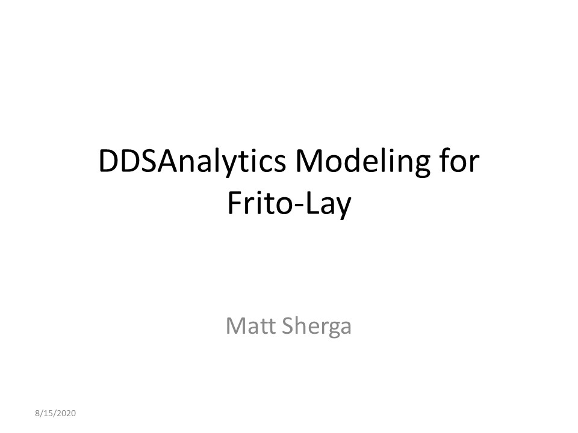
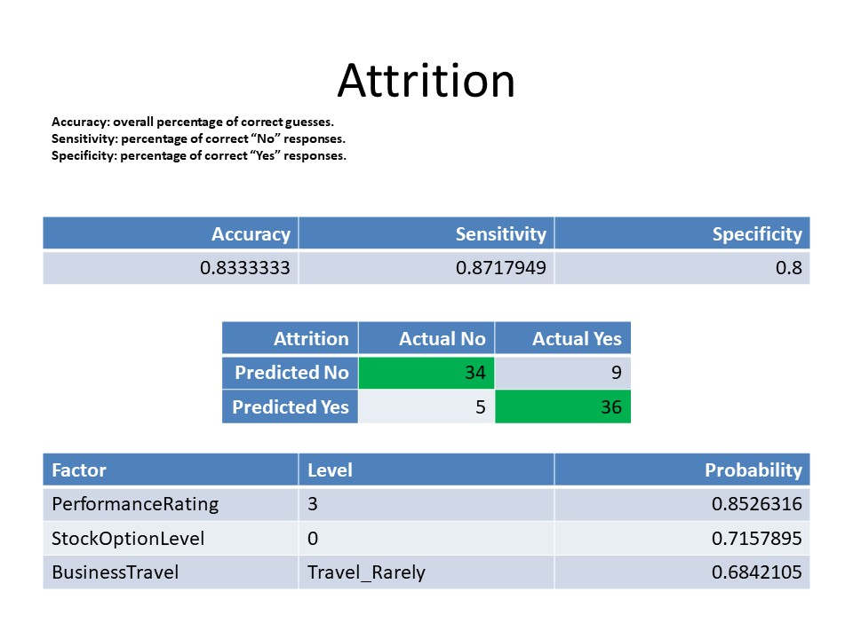
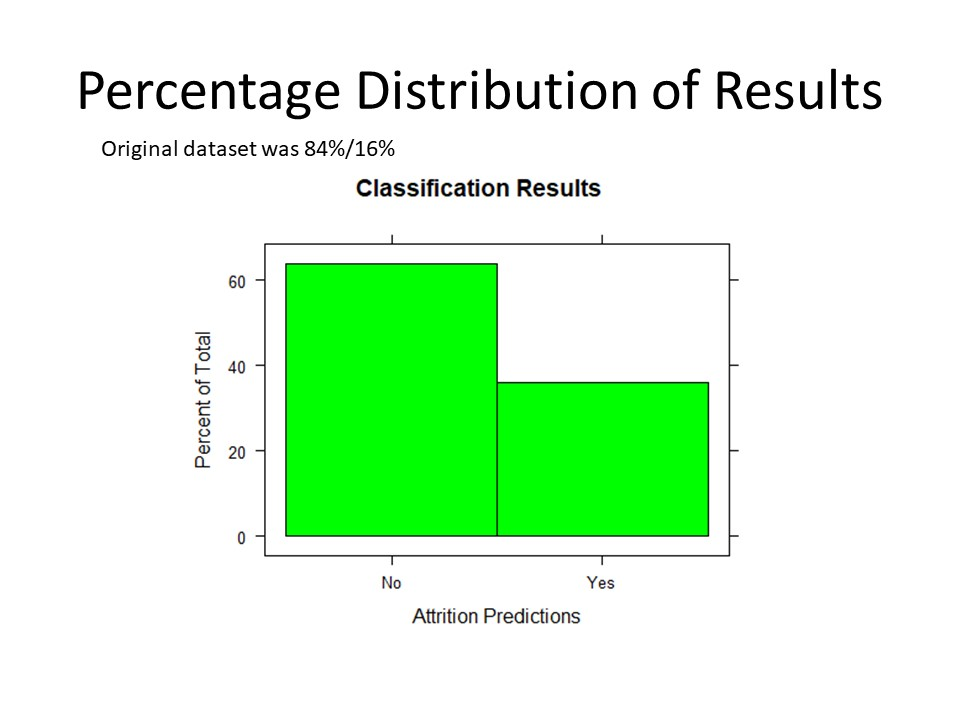
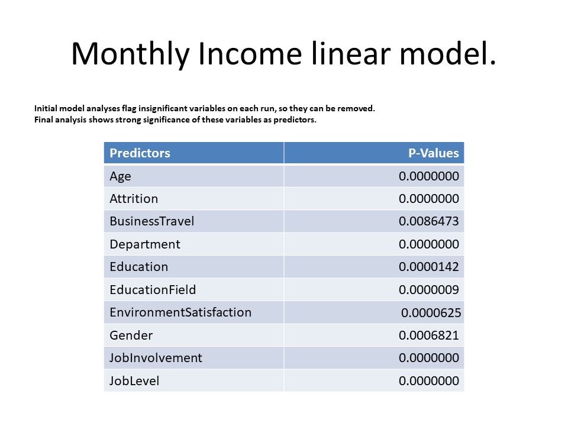
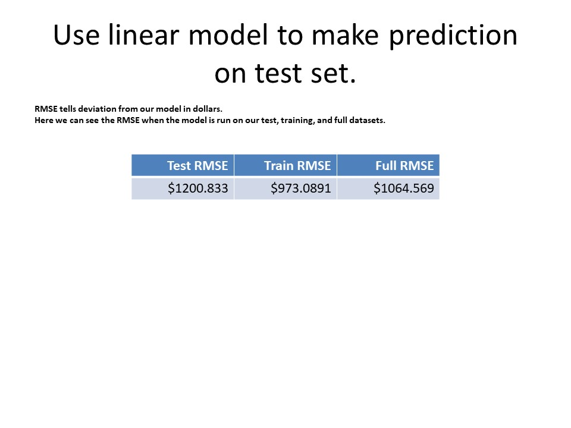
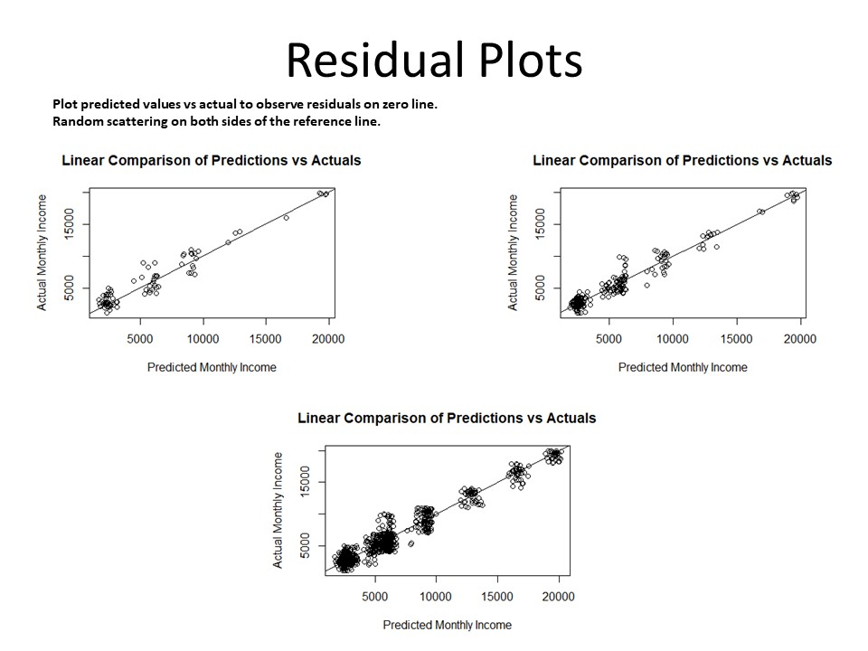
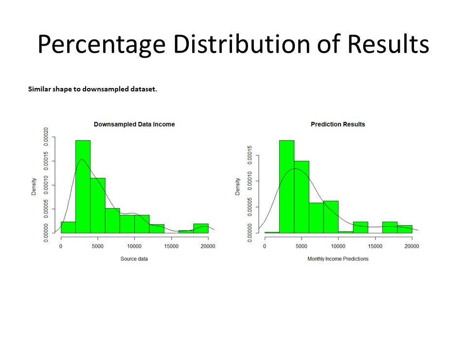
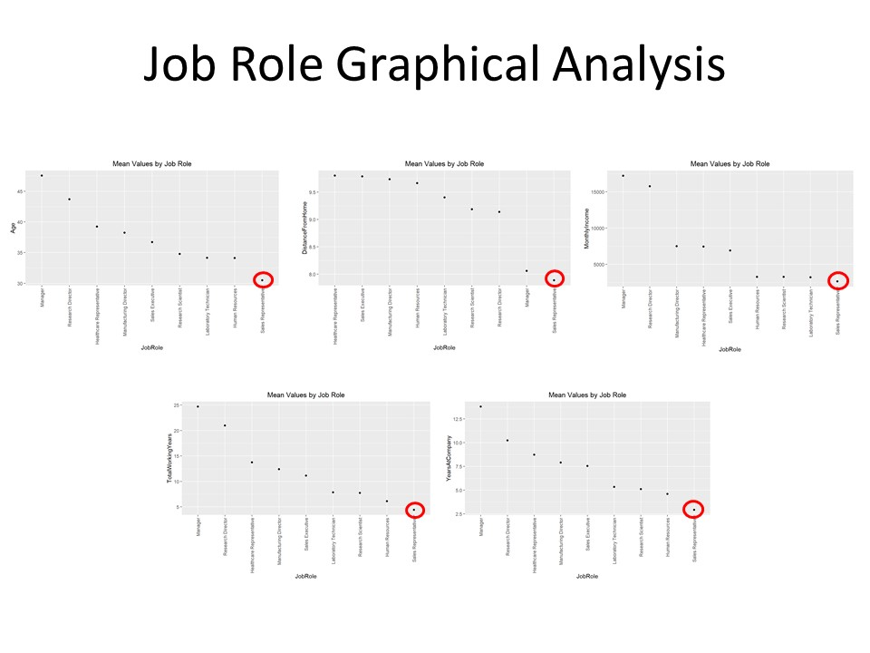
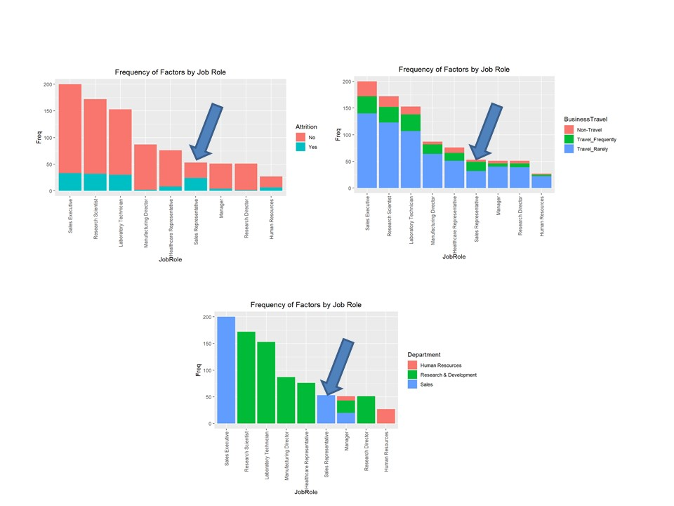
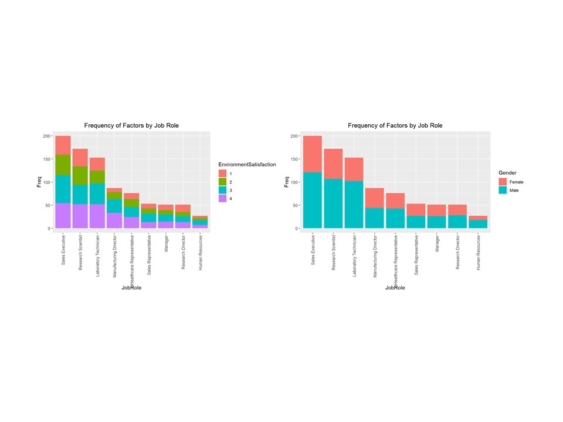

[Watch my presentation](https://youtu.be/lnrLYs5pkfc "Youtube Video")

## Description: 
|       DDSAnalytics has requested an analysis of employee data with the intent to decrease the rate of attrition, as well as form a model for predicting attrition, and another model for predicting monthly income based on whatever factors are found to be influential. Additional analysis is welcome.


|       Analyze existing employee data at DDSAnalytics to:  
1. Predict employee Attrition  
2. Identify any Job-Role specific trends  
3. Determine the top three most influential factors that contribute to Attrition  
4. Establish criteria for predicting monthly income, and create a regression model  

## Process:
|       First, the data was cleaned and organized. There were no missing values, and the data was comprised of both categorical and continuous variables. The categories “EmployeeCount”, “Over18”, and “StandardHours” all only had one level so they were removed from the data.

|       Next, the mean of each continuous variable, and a frequency bar chart for categories, were plotted according to Job Role. Sales Representatives are, on average, the youngest, live closest to work, the lowest monthly income, fewest working years, and fewest years at the company. When looking at attrition, you can see that they also have the highest rate of departures compared to any other job role (almost 50%). If you take a look at business travel, a substantial percentage of sales reps travel frequently when compared to other roles. Sales representatives make up a relatively small portion of the Sales department, especially when compared to Sales Executives. This may be due to the higher rate of attrition in that role, but at a lower income it seems like you might get value at accelerating hiring of this role.  

|       Environment Satisfaction scores were mostly evenly distributed within and across every job role. You also look to have good gender diversity across all job roles, although research scientists and lab techs look to be slightly higher percentage male, as does human resources.  

|       The data was heavily skewed toward “No” for attrition, so it was randomly subsampled to compare with less bias. A best seed was found for creating test and train samples, and Naïve Bayes was run on the data. It was found that the top three highest probability Attrition factors are employees who Travel Rarely (conditional prob = .68), Stock Option level of 0 (cp = .71), and performance rating of 3 (cp = .85). The model we created had an accuracy of .833, Sensitivity of .871, and Specificity of .800 when run against the test set. When used to predict attrition for the competition data, the outcome was again heavily skewed toward “no” attrition. So if that data sample is representative of our starting dataset, this reinforces our model.  

|       For our second model, we set out to determine what factors can be used to predict monthly income. Again, the data was split into a training and test set, and this time we ran linear regression against all variables. An ANOVA was run to determine what variables are significant predictors in our model. We then re-ran the regression, and ANOVA until all our predictors had significant p-values < .05. Age, Attrition, Business Travel, Department, Education, EducationField, EnvironmentSatisfaction, Gender, JobInvolvement, JobLevel, and JobRole were all deemed significant in our model. Each had a p-value <.001 except for business travel with a .008. The model was run against the test set, the train set, and the full dataset to receive respective RMSE values of $1200.83, $973.09, and $1064.57. We then created residual plots for each of these, and see that the data is randomly scattered along the zero line with no influential points. Finally, density plots were compared between the predictions on the competition sets, and on the downsampled data. They have very similar shapes, which reinforces the strength of the model.  


```{r setup, include=FALSE}
knitr::opts_chunk$set(message = FALSE)
```


```{r}
# Load the libraries in R 
library(MASS)
library(ggplot2)
library(dplyr)
library(e1071)
library(caret)
library(psych) 
library(Amelia)#missmap for graphing missing values
library(broom) #tidy
library(DescTools)
library(car) #outliertest
library(readxl)
library(knitr)#nicer tables for ppt
library(rminer)#variable importance for NB
library(rms)
library(GGally)
library(tidyverse)
```


# EDA How does the dataset look?
### No missing values
### EmployeeNumber was not removed because I do not know if there is a system to assigning them. It may have some meaning I'm unaware of.
```{r}
# Set global seed. Load the dataset from the file system and convert appropriate columns to factors, and remove factors with only one level.
set.seed(123)

df1 <- read.csv("CaseStudy2-data.csv")
#any missing data? no
missmap(df1)
```

# What data is categorical?
```{r}
#learn more about it
str(df1)
describe(df1)
summary(df1) #need to convert all character and scales to factors, and remove ID column.
dfsubset <- df1[,2:33]

factorcolumns<- c("BusinessTravel", "Department", "Education", "EducationField", "EnvironmentSatisfaction", "Gender", "JobInvolvement", "JobLevel", "JobRole", "JobSatisfaction", "MaritalStatus",	"NumCompaniesWorked", "OverTime", "PerformanceRating", "RelationshipSatisfaction",	"StockOptionLevel",	"TrainingTimesLastYear", "WorkLifeBalance")
```
```{r}
kable(factorcolumns, col.names = "Factor Variables")
```


# Can any variables be confidently removed?
## One level: EmployeeCount, Over18, StandardHours
```{r}
                  
dfsubset[,factorcolumns] <- lapply(df1[,factorcolumns], as.factor)
dffactors <- dfsubset %>% mutate_if(is.character,as.factor)
#found factors with only one level. so these can be removed as they are not useful.
kable(sapply(dffactors, function(vals) length(unique(vals))), col.names = "Levels") #returns the count of unique values in each column. 
#EmployeeCount, Over18, and StandardHours all only one unique value.
dffactors <- dffactors[,sapply(dffactors, function(vals) length(unique(vals)))>1]

```

```{r}

#subset to collect names for all columns except jobrole
dfnumbers<-colnames(dffactors %>% select_if(is.numeric))
nojob<-subset(dffactors, select = -c(JobRole))
dfothers<- colnames(nojob %>% select_if(negate(is.numeric)))


for (i in 1:length(dfnumbers)) {
  aggmeans <- aggregate(get(dfnumbers[i])~JobRole, dffactors, mean)
  names(aggmeans)[2] <- dfnumbers[i]
  
  plot<-ggplot(aggmeans, aes(x = reorder(as.factor(get(colnames(aggmeans[1]))), -get(colnames(aggmeans[2]))), y = get(colnames(aggmeans[2])))) + 
    labs(y= colnames(aggmeans[2]), x = colnames(aggmeans[1])) + 
    geom_point() + 
    ggtitle('Mean Values by Job Role') + theme(plot.title = element_text(hjust = .5), axis.text.x = element_text(angle = 90, vjust = 0.5, hjust=1))
  
  print(plot)
  
}

#Factor frequency counts per job role
for (i in 1:length(dfothers)) {
  
  unq<-data.frame(with(dffactors, table(get(dfothers[i]), JobRole)))
  
  factorplot <- ggplot(unq, aes(x = reorder(as.factor(get(colnames(unq[2]))), -get(colnames(unq[3]))), y = get(colnames(unq[3])), fill = Var1)) + 
    labs(y= colnames(unq[3]), x = colnames(unq[2]), fill= dfothers[i]) + 
    geom_bar(position= "stack" , stat="identity") + 
    ggtitle('Frequency of Factors by Job Role') + theme(plot.title = element_text(hjust = .5)) +
    theme(axis.text.x = element_text(angle = 90, vjust = 0.5, hjust=1))
  
  print(factorplot)
  
}


```


# Is the data balanced?
### Modeling to predict attrition needs unbiased data. Too many "no" responses. Downsampled to fix.
```{r}
#check for uneven response variable
kable(table(dffactors$Attrition), col.names = c("Attrition", "Total"))
#downsample to randomly give sample with same number of Yes/No
dflevels <- dffactors[,factorcolumns]
dflevels$Attrition <- dffactors$Attrition
dfNo<- dflevels[which(dflevels$Attrition == "No"),]
dfYes<- dflevels[which(dflevels$Attrition == "Yes"),]
downsamp<-sample(seq(1:length(dfNo$Attrition)), length(dfYes$Attrition))
downsamp <- dfNo[downsamp,]
downsamp <- rbind(downsamp,dfYes)

```

# Find the best randomization seed for splitting our data into training and test sets, and set the seed.
```{r}
#find best seed for splitting into train and test set
cmloop <- data.frame()
for (i in 1:100) {
  
  #set seed, take 70% sample and split the data set by the sample data (.7 train/.3 test).
  set.seed(i)
  trainIndicesloop <- sample(seq(1:length(downsamp$Attrition)),round(.7*length(downsamp$Attrition)))
  traindfloop <- downsamp[trainIndicesloop,]
  testdfloop <- downsamp[-trainIndicesloop,]
  testdf2loop <- subset(testdfloop, select = -c(Attrition))
  
  #NB training model
  trnattrloop = naiveBayes(Attrition~.,data = traindfloop)
  #predict attrition of test set
  nbpredattrloop<-predict(trnattrloop,testdf2loop)
  #make a table of predictions vs actuals
  tblcmloop<-table(nbpredattrloop,testdfloop$Attrition)
  #confusion matrix. columns are actual.
  CM7loop<- caret::confusionMatrix(tblcmloop)
  CM7df1loop<-data.frame(t(CM7loop$overall))
  accloop<-CM7df1loop$Accuracy
  CM7df2loop<-data.frame(t(CM7loop$byClass))
  sensloop<-CM7df2loop$Sensitivity
  specifloop<-CM7df2loop$Specificity
  #build a dataframe from each loop to indicate best seed for training/test split
  cmloop <- rbind(cmloop, data.frame(accloop, sensloop, specifloop))
  
}

#build a df with the maxmeans
maxmeans <- data.frame(Row = which.max(rowMeans(cmloop)))
maxmeans <- cbind(maxmeans,cmloop[which.max(rowMeans(cmloop)),])

#What row had the highest mean of accuracy + sensitivity + specificity, and what were the values?
kable(maxmeans, col.names = c("Seed", "Accuracy", "Sensitivity", "Specificity"), row.names = F)

```

# Run the model.
### What are conditions with highest probability of predicting Attrition as "yes"?
### Accuracy: overall percentage of correct guesses.
### Sensitivity: percentage of correct "No" responses.
### Specificity: percentage of correct "Yes" responses.
### Prediction table helps explain.

```{r}
#set seed to that row number, which is 68.
set.seed(which.max(rowMeans(cmloop)))

#split the data into training and test set. remove attrition from test set.
trainIndices <- sample(seq(1:length(downsamp$Attrition)),round(.7*length(downsamp$Attrition)))
traindf <- downsamp[trainIndices,]
testdf <- downsamp[-trainIndices,]
testdf2 <- subset(testdf, select = -c(Attrition))

#NB training model and prediction
nbmodel = naiveBayes(Attrition~.,data = traindf, type = "raw")

#Use conditional probabilities to locate highest attrition factors
levelloop <- data.frame()
for (i in 1:length(factorcolumns)) {
  
  df<-data.frame(nbmodel$tables[i])
  Yes<- df[which(df[1] == "Yes"),]
  Level<- Yes[which(Yes[3] > .2),]
  levelloop <- rbind(levelloop, data.frame(Factor = factorcolumns[i],Level = Level[,2],Probability= Level[,3]))
}

#save our best 3 factors
Topfactors<-tail(levelloop[order(levelloop$Probability),], 3)
kable(Topfactors, row.names = F)
```

```{r}

#make predictions
preds <- predict(nbmodel, testdf2)

#find out how the model predictions compare to the test dataset actual values.
dfcm <- caret::confusionMatrix(table(preds,testdf$Attrition))
#Accuracy = .833
#Sensitivity = .871
#Specificity = .8
#It did great!
kable(dfcm$table)
```

```{r}
#build a df with the maxmeans
dfcmtbl <- data.frame(Accuracy = dfcm$overall[1])
dfcmtbl <- cbind(dfcmtbl, Sensitivity = dfcm$byClass[1])
dfcmtbl <- cbind(dfcmtbl, Specificity = dfcm$byClass[2])

#What were our prediction statistics?
kable(dfcmtbl, row.name = F)

```

# Predicted Classifications
```{r}
#read in the competition dataset, and wrangle it like our original data but keep the ID column.
compset <- read.csv("CaseStudy2CompSet No Attrition.csv")

compsetresults <- compset

compsetresults[,factorcolumns] <- lapply(compset[,factorcolumns], as.factor)
compsetresults <- compsetresults %>% mutate_if(is.character,as.factor)

#run our model on the dataset, subset it to just IDs and Attrition, and write it to a csv file without rownames.
comppreds <- predict(nbmodel, compsetresults)
compsetresults$Attrition <- comppreds
compsetresults <- subset(compsetresults, select = c(ID, Attrition))
write.csv(compsetresults, file = "Case2PredictionsSherga Attrition.csv", row.names = F)
```
```{r}
kable(head(compsetresults))
```


# Percentage Distribution of Results
```{r}
histogram(compsetresults$Attrition, xlab = "Attrition Predictions", main = "Classification Results",  col = "green")
```

# Monthly Income linear model.
### Initial model analyses flag insignificant variables on each run, so they can be removed.
### Final analysis shows strong significance of these variables as predictors.
```{r}
#create a new downsampled dataset with a different seed and turn into train and test data.
set.seed(4)
dfNo2<- dffactors[which(dffactors$Attrition == "No"),]
dfYes2<- dffactors[which(dffactors$Attrition == "Yes"),]
downsamp2<-sample(seq(1:length(dfNo2$Attrition)), length(dfYes2$Attrition))
downsamp2 <- dfNo2[downsamp2,]
downsamp2 <- rbind(downsamp2,dfYes2)

trainIndices2 <- sample(seq(1:length(downsamp2$MonthlyIncome)),round(.7*length(downsamp2$MonthlyIncome)))
traindf2 <- downsamp2[trainIndices,]
testdf2 <- downsamp2[-trainIndices,]
testdf3 <- subset(testdf2, select = -c(MonthlyIncome))


salarylm <- lm(MonthlyIncome~., data = traindf2)

#ANOVA to find out which variables are significant in our model.
anva <- anova(salarylm)
#only keep the variables that are 95% significant.
anva <- anva[which(anva$`Pr(>F)` < .05),]
anva

#list of significant variables, and include MonthlyIncome.
sigterms <- tidy(anva)$term
sigterms[nrow(as.data.frame(sigterms)) + 1] <- "MonthlyIncome"
salarylm <- lm(MonthlyIncome~., data = traindf2[,sigterms])
anva <- anova(salarylm)
anva <- anva[which(anva$`Pr(>F)` < .05),]
anva


```
```{r}
#all remaining variables are significant
#display all best predictors
predtbl<-data.frame(Predictors = tidy(anva)$term)
predtbl$`P-Values` <- anva$`Pr(>F)`
kable(predtbl)

```

# Use linear model to make prediction on test set.
### RMSE tells deviation from our model in dollars.
### Here we can see the RMSE when the model is run on our test, training, and full datasets.
```{r, warning=FALSE}
#use model to make prediction on our test set.
lmpreds <- predict(salarylm, testdf3)
#calculate the error by finding the difference between predictions and actuals. then calculate the root mean square error.
err <- lmpreds - testdf2$MonthlyIncome
RMSEdf <- data.frame(Test_RMSE = sqrt(mean(err^2)))
#RMSE = $1200.833 monthly income

lmpredstrain <- predict(salarylm, traindf2)
#calculate the error by finding the difference between predictions and actuals. then calculate the root mean square error.
errtrain <- lmpredstrain - traindf2$MonthlyIncome
RMSEdf$Train_RMSE <- sqrt(mean(errtrain^2))
#RMSE = $973.089 monthly income

lmpredfull <- predict(salarylm, dffactors)
#calculate the error by finding the difference between predictions and actuals. then calculate the root mean square error.
errfull <- lmpredfull - dffactors$MonthlyIncome
RMSEdf$Full_RMSE <- sqrt(mean(errfull^2))
#RMSE = $1064.57 monthly income

kable(RMSEdf, col.names = c("Test RMSE", "Train RMSE", "Full RMSE"))
```


# Residual Plot
### Plot predicted values vs actual to observe residuals on zero line. 
### Random scattering on both sides of the reference line.
```{r}
#plot model predictions compared to actuals, in order to see regression trend.
plot(lmpreds,testdf2$MonthlyIncome,
     xlab = "Predicted Monthly Income",ylab = "Actual Monthly Income", main = "Linear Comparison of Predictions vs Actuals")
abline(a = 0, b = 1)
```

```{r}

#plot model predictions compared to actuals, in order to see regression trend.
plot(lmpredstrain,traindf2$MonthlyIncome,
     xlab = "Predicted Monthly Income",ylab = "Actual Monthly Income", main = "Linear Comparison of Predictions vs Actuals")
abline(a = 0, b = 1)
```

```{r}

#plot model predictions compared to actuals, in order to see regression trend.
plot(lmpredfull,dffactors$MonthlyIncome,
     xlab = "Predicted Monthly Income",ylab = "Actual Monthly Income", main = "Linear Comparison of Predictions vs Actuals")
abline(a = 0, b = 1)
```

# Predicted Monthly Incomes
```{r}
#read in the competition dataset, and wrangle it like our original data but keep the ID column.
salcompset <- read_xlsx("CaseStudy2CompSet No Salary.xlsx")

salcompsetresults <- salcompset

salcompsetresults[,factorcolumns] <- lapply(salcompset[,factorcolumns], as.factor)
salcompsetresults <- salcompsetresults %>% mutate_if(is.character,as.factor)


#run our model on the dataset, subset it to just IDs and monthlyincome, and write it to a csv file without rownames.
salcomppreds <- round(predict(salarylm, salcompsetresults), digits = 2)
salcompsetresults$MonthlyIncome <- salcomppreds
salcompsetresults <- subset(salcompsetresults, select = c(ID, MonthlyIncome))
write.csv(salcompsetresults, file = "Case2PredictionsSherga Salary.csv", row.names = F)

```
```{r}
kable(head(salcompsetresults))
```


# Percentage Distribution of Results
### Similar shape to downsampled dataset.
```{r}
hist(salcompsetresults$MonthlyIncome, xlab = "Monthly Income Predictions", main = "Prediction Results",  col = "green", prob = TRUE)
lines(density(salcompsetresults$MonthlyIncome, adjust = 2))
```

```{r}

hist(downsamp2$MonthlyIncome, xlab = "Source data", main = "Downsampled Data Income",  col = "green", prob = TRUE)
lines(density(downsamp2$MonthlyIncome))
```


# PowerPoint Slides













